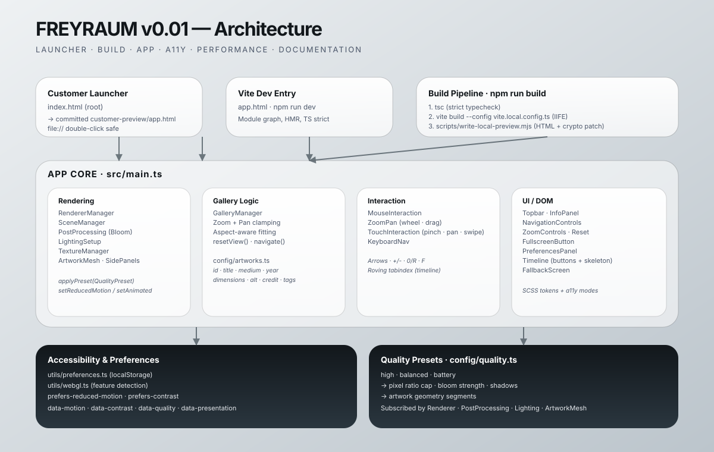

# FREYRAUM customer handoff guide
> Last full markdown audit: 2026-05-21 (v0.24.2 deep loading research + strict all-paintings-before-enter planning pass; all Markdown files refreshed).

## v0.23 handoff note — performance/preloading

Runtime remains v0.22, but the next performance task is planned. Before telling customers the gallery is fully smooth for large exhibitions, implement and validate the N-series plan in `plan.md`: per-artwork readiness diagnostics, budgeted GPU warming beyond 15 artworks, procedural pre-generation for the critical navigation window, and navigation-aware prefetch priority.

## v0.22 — shipped (2026-05-21) — Improved Preloading + Press-to-Start

Current status: shipped. Runtime now preloads albedo plus PBR texture sets for the first 15 artworks under the loading overlay, warms each cached artwork texture set on the GPU before reveal, keeps the branded loader visible for at least 500 ms, and waits for the accessible "Galerie betreten" button before entering the gallery. Validation: `npm run lint` and `npm run build` passed after implementation; `npm audit --audit-level=moderate` still reports the known Vite/esbuild development-server advisory that requires a semver-major upgrade.

## v0.21 — implementation shipped (2026-05-21)

Current status: shipped. The v0.21 plan is implemented in runtime code and documentation: branded progress loading overlay, Three.js LoadingManager progress, pre-reveal GPU warm render + awaited shader prewarm, audio `preload='auto'`, adjacent/idle PBR prefetch, lighting resume clamp, WebGL restore status, max-texture diagnostics, shader precision guard, 16K importer guidance, global pointer tracking, timeline arrows/counter/edge fades/responsive sizing/virtualized large-list rendering, and cleanup for added global listeners. Future-only boundaries remain LOD/tiled streaming for device-limited 16K detail and grouped/page timeline navigation for very large exhibitions.

### Validation and residual risk

- Baseline before code changes: `npm install`, `npm run lint`, and `npm run build` passed.
- Final validation after v0.21 implementation and docs sync: `npm run lint` and `npm run build` passed.
- Security audit: `npm audit --audit-level=moderate` still reports the pre-existing moderate Vite/esbuild development-server advisory; the available fix requires a breaking Vite major upgrade and was left as a separate dependency-upgrade task.

## v0.20.8 — Complete v0.20 implementation shipped (2026-05-21)

Current status: shipped. The v0.20.7 gap-closure plan is now implemented in code and this file was refreshed during the all-markdown sync. Remaining v0.20 audio/control quality gaps are closed: fade targets clamp to the 0.30 effective-gain ceiling, diagnostics include display percent, preference patching updates non-slider controls during volume drags, sliders expose German percent value text, zero-volume recovery logs stored/recovered values, first-interaction recovery also covers pre-play audio, unmute resumes within `BackgroundAudioManager`, slider fill CSS stores percentages, and the ended-loop fallback fade is shortened to 50 ms. F-09 was confirmed correct and required no code change.

## v0.20.6 — Audio stabilization follow-up implemented (2026-05-21)

Current handoff status for the reported audio/UI follow-up:

- startup defaults remain unmuted,
- runtime no longer re-triggers unnecessary play fades during normal preference churn,
- autoplay-blocked playback now gets a one-shot retry on first user interaction (including arrow-key navigation),
- quick audio control sizing and nav-arrow focus visuals were polished.

Reference: `plan.md § v0.20.6`, `FINDINGS.md § 2026-05-21 — v0.20.6 implementation findings`.

## v0.20.5 — Audio regression follow-up (2026-05-21, substantially resolved)

All previously reported customer-visible audio regressions are **confirmed resolved** as of the v0.20.7 code audit:

- startup loudness: ✅ correct (UI 50% = 15% effective)
- mute/unmute restores to target: ✅ `targetVolume` never overwritten by fade
- slider source of truth: ✅ both sliders read `targetVolume`
- quick control placement: ✅ top-right cluster, confirmed in `src/styles/main.scss:436`

Ten quality-improvement items (F-01 through F-10) are documented with TypeScript code patches in `plan.md § v0.20.7`.

Current handoff rule: describe background audio as **fully implemented and verified**. Canonical references: `plan.md § v0.20.7` and `FINDINGS.md § 2026-05-21 — v0.20.7 deep code audit`.

## v0.20.3 technical audio enhancement roadmap — implemented in v0.20.4

## v0.20.2 audio UX follow-up — implemented in v0.20.4

## v0.20 audio + sidecar fixes — implemented (2026-05-20)

Three fixes shipped in v0.20, but the runtime audio UX now has a documented follow-up in `v0.20.5`:

1. **Audio plays correctly from file:// origin.** Previous CORS misconfiguration prevented audio loading in Chrome/Opera/Edge. Fixed — music plays immediately on first user interaction or autoplay (when browser allows it).
2. **Sidecar text always up-to-date.** Every `Update Gallery` run now cache-busts the gallery script URLs so updated painting text appears immediately without needing to clear the browser cache.
3. **Main-page mute/volume controls.** A quick-control widget was added in v0.20, but its current location and runtime loudness behavior are still under follow-up and must not be described as final.

**Updated checklist for customer audio (v0.20):**

- Put music files into `customer-audio/inbox` (`.mp3`, `.ogg`, `.m4a`, `.wav`).
- Run `Update Gallery`.
- Open `customer-preview/app.html` (double-click or use the `.command`/`.bat` launcher).
- Audio importer, startup loudness, mute recovery, slider sync, and control placement are all confirmed correct by the v0.20.7 code audit.
- If audio behavior looks wrong, collect diagnostics and treat it as an open regression rather than expected final behavior.

## v0.19 background music workflow — implemented (2026-05-20)

Background-audio workflow is live: customers place compatible audio files in `customer-audio/inbox` and use the existing `Update Gallery` flow.

Current status: **fully shipped**. Audio importer flow, controls, startup loudness, mute recovery, slider sync, and placement are all confirmed correct by the v0.20.7 code audit.

Canonical implementation reference: `plan.md § v0.19`

Quick handoff checklist for customer audio:

- Put music files into `customer-audio/inbox` (`.mp3`, `.ogg`, `.m4a`, `.wav`).
- Run `Update Gallery`.
- Confirm `customer-artworks/last-import-report.txt` contains the audio sections (`Audio selected`, `Audio candidates ignored by precedence`, `Unsupported audio files`).
- In preview, audio controls exist in the settings panel and via a quick-control widget, but the current quick-control placement and runtime loudness behavior are not yet final.

## v0.18 sidecar text — implemented (2026-05-20)

The sidecar-text workflow is **live in v0.18**. The importer reads
same-basename `.txt` files beside each painting and merges customer text
into the gallery info panel.

- Customer guide (how to import text): `docs/CUSTOMER_TEXT_GUIDE.md`
- Copy-paste template: `customer-artworks/ARTWORK_TEXT_TEMPLATE.txt`
- Final plan + acceptance: `plan.md § v0.18`
- Research log: `FINDINGS.md § 2026-05-20`

Implementation is confined to `scripts/import-artworks.mjs` (zero new
dependencies). TypeScript runtime code (`src/`) did not need changes,
and the offline `file://` preview plus `webglImage` path remain
unchanged. Missing or invalid sidecars never fail the import; they are
surfaced through the existing plain-language report.

This document supports presenting FREYRAUM to customers and onboarding new
contributors. **Current runtime status: v0.20 implemented (on top of v0.19, v0.18, v0.17, v0.16, v0.15, and v0.14).**

## AI/contributor context

Before planning significant changes, read:

- `ARCHITECTURE_MAP.md`
- `AI_RULES.md`
- `.github/copilot-instructions.md`
- `.github/prompts/`
- `LESSONS_LEARNED.md`
- `DOCUMENTATION_RULES.md`
- latest `plan.md`, `FINDINGS.md`, and `CHANGELOG.md` entries

These files capture repository boundaries, validation expectations, durable lessons, and reusable AI review loops.

Latest notes:

- v0.17 (2026-05-20): PreferencesPanel ARIA fixes, legacy interaction cleanup, deprecated API removal. Runtime validation: `npm run lint` ✅, `npm run build` ✅.
- Maintenance risks carried forward: moderate Vite/esbuild audit advisories (need semver-major upgrade), ESLint v8 EOL, TypeScript/parser supported-version drift.
- Developer support should collect `window.__FREYRAUM_DIAGNOSTICS__.snapshot()` or `.exportJson()` when customer behavior is unclear.

## v0.17 implemented — accessibility fixes and dead-code removal (2026-05-20)

Follow-up shipped on 2026-05-19 after customer feedback that v0.16.1 was only a partial fix:

- **Settings gear now verified opening in the built preview.**
- **Center left/right buttons now have extra visual shell space** so their hover state is no longer lightly clipped.

Code locations:

- `src/styles/main.scss`
- rebuilt preview stylesheet: `customer-preview/style.css`

Validation:

- `npm run lint` ✅
- `npm run build` ✅
- Headless Chromium + SwiftShader verified that clicking `.prefs__trigger` opens `.prefs__panel`.

## v0.16.1 implemented — UI hotfix (settings + center nav hover clipping)

Customer-reported regression fixed on 2026-05-19:

- **Settings button/panel works again.** `.prefs` was removed from CSS paint containment so the absolute popover is no longer clipped to the trigger box.
- **Center left/right hover clipping removed.** `.nav-controls` was removed from CSS paint containment so hover-scaled nav buttons paint fully.

Code location:

- `src/styles/main.scss` (containment block near the v0.16 quality/fallback section)

Validation note:

- Fresh-clone baseline initially failed before dependency install (environment setup only), then full checks passed after install: `npm run lint` ✅ and `npm run build` ✅.

## v0.16 implemented — Deep performance and compatibility pass (2026-05-19)

The v0.16 audit is now live in the runtime. Every actionable finding was implemented; four optional items were explicitly deferred with documented rationale (pinch hot-path micro-optimization, `ImageBitmapLoader`, `FrameBudgetMonitor` running sum, deletion of v0.11 dead-code interaction files). Highlights:

- **Single resize coordinator** in `main.ts` (debounce + rAF + measured `(w,h)` forwarded to renderer, composer, and camera). `SceneManager.updateAspect()` and `PostProcessing.resize()` replace the old per-class `window.resize` listeners.
- **Page Visibility + Page Lifecycle suspension.** `pageInactive` flag gates `postProcessing.render()` and per-frame light/material updates; `frameBudget.markNavigation()` is called on resume to suppress adaptive downgrades from the catch-up spike.
- **`RendererManager.prewarm()`** calls `compileAsync()` after boot and every deferred preset apply.
- **`RendererManager.getRendererSnapshot()`** + 5 s periodic info-mode log of `renderer.info`.
- **Anisotropy no-op guard** in `TextureManager.setAnisotropyDivisor()`.
- **Idle-scheduled preference apply** with `setTimeout(0)` fallback.
- **`navigator.deviceMemory` + `hardwareConcurrency`** hints in `suggestStartupQuality()`.
- **Debug-only Long Tasks observer** in `main.ts`.
- **CSS containment + battery-preset blur reduction + `@supports` `backdrop-filter` fallback** in `main.scss`; `:root[data-quality]` mirror written by `RendererManager.applyPreset()`.
- **Importer GPU texture-memory warnings** (>4096 px and >64 MB / >128 MB GPU footprint).
- **Dispose idempotency** in `RendererManager` and `CanvasInteraction`.

Validated with `npm run lint`, `npm run build`, and `node -c scripts/import-artworks.mjs`.

## v0.16 final audited brainstorm — Code-level performance audit (2026-05-19 final, design history)

The v0.16 plan is now the **final** audited brainstorm. The original 12 file:line-anchored findings still stand, and the final pass added 6 researched enhancements: Page Lifecycle `freeze` / `resume`, shader pre-warm with `renderer.compileAsync()`, optional `ImageBitmapLoader` raster path, `deviceMemory` / `hardwareConcurrency` first-run hints, debug-only Long Tasks API instrumentation, and CSS `contain` / internal `content-visibility`. That particular pass was documentation-only (runtime implementation happened in the section above).

Start future performance work from: `plan.md` → `v0.16 — Deep performance and compatibility optimization (implemented)` and `FINDINGS.md` → `2026-05-19 (implementation completed) — v0.16 deep code audit`.

**Priority order (all with code samples in plan.md):**
1. Renderer info diagnostics (`RendererManager.ts`, `main.ts`) — establish measurement baseline.
2. Single resize coordinator — remove independent `window.resize` from `SceneManager` and `PostProcessing`; call from debounced + RAF-deferred coordinator in `main.ts`.
3. Cache DOM element references + defer reads into RAF (`main.ts`).
4. Page Visibility + Page Lifecycle suspend/resume (`main.ts`, `GalleryManager.ts`) — prevents false adaptive-quality downgrades and handles `freeze` / `resume`.
5. Shader-define deferral via `requestIdleCallback` plus post-change pre-warm via `renderer.compileAsync()` (`main.ts`, `RendererManager.ts`).
6. Pinch hot-path (log-space squared-distance zoom, dispose idempotency) (`CanvasInteraction.ts`).
7. Anisotropy no-op guard (`TextureManager.ts`).
8. CSS `@supports` fallback + `[data-quality]` blur reduction + containment (`main.scss`, `RendererManager.ts`).
9. Import-time texture memory warnings (`scripts/import-artworks.mjs`).
10. Optional `ImageBitmapLoader` raster path where safe (`TextureManager.ts`).
11. Progressive startup heuristics with `deviceMemory` / `hardwareConcurrency` (`performance.ts`).
12. Debug-only Long Tasks API instrumentation (`main.ts`, `Diagnostics.ts`).
13. Disposal ownership JSDoc (all affected files).

## v0.15 elegant animation system — Implemented (2026-05-19)

v0.15 shipped on 2026-05-19 in `src/gallery/GalleryManager.ts`, `src/utils/math.ts`, `src/ui/InfoPanel.ts`, `src/styles/main.scss`, and `src/main.ts`:

- new `smoothDamp(current, target, lambda, dt)` utility — `α = 1 − exp(−λ·dt)` — replaces frame-rate-dependent per-frame lerp;
- `GalleryManager.update(now: number)` uses the `DOMHighResTimeStamp` already available in the animate loop. All 13 prior per-frame lerps are now lambda-driven (`12` hover, `2.5` nav position, `3.0` nav scale, `4.0` camera zoom, `5.0` camera pan), plus a 14th line for the new `position.z` recession;
- navigation entrance seeds: `position.x` ±3.2 → ±4.5, `rotation.y` ±0.32 → ±0.15 rad, `scale` 0.84 → 0.88, new `position.z` = -0.6;
- `InfoPanel` 200 ms / 320 ms timing bug fixed: `CONTENT_SWAP_DELAY_MS = 520` + `requestAnimationFrame` before fade-in;
- semantic SCSS tokens (`--ease-gallery-out`, `--ease-gallery-in-out`, `--dur-control`, `--dur-content`, `--dur-panel`, `--dur-timeline`, `--dur-reveal`) with backward-compatible aliases;
- `.info-panel`, `.timeline__thumb`, `.prefs__panel`, `@keyframes prefs-in`, `.loading-overlay`, `.loading-spinner` retuned to museum-elegant durations and `--ease-gallery-out`;
- `.info-panel.is-transitioning` translateY raised from 8 px to 16 px;
- `loadingOverlay.remove()` timeout raised from 700 ms to 950 ms to match `--dur-reveal: 0.9s`;
- new diagnostics fields on `navigate` / `goTo`: `motionMode`, `seedPositionX`, `seedPositionZ`, `settleTargetMs`.
- v0.15.1 hotfix: reduced motion now affects motion only and no longer reduces
  painting texture/shader fidelity (quality remains preset-controlled).

**Validation:** `npm run lint` ✅ and `npm run build` ✅. Preview bundle regenerated.

## v0.15 elegant animation system — Original audit (2026-05-19)

The next documented implementation pass should make animations smoother, longer, and more visible while preserving the premium modern-art style.

Implementation should start from `plan.md` → "v0.15 — Planned: elegant animation system — full technical brainstorm" and `FINDINGS.md` → "2026-05-19 — v0.15 technical deep audit: elegant longer animations".

Important constraints:

- keep reduced motion as a hard requirement;
- do not add a heavy animation dependency;
- convert `GalleryManager.update()` smoothing to frame-rate-independent timing before final retuning;
- fix the `InfoPanel.ts` 200ms content-swap timing bug before retuning panel durations;
- replace overshooting `--ease-spring` uses on the timeline and prefs panel with a calmer gallery easing curve;
- keep DOM animations on `transform`/`opacity` where possible;
- preserve v0.14.2 zoom/pan constants unless visual QA proves they must change;
- add only concise diagnostics for motion mode and intended settle timing.

## v0.14.2 vertical pan tightening — Implemented (2026-05-19)

Follow-up after v0.14 customer feedback: top/bottom pan range should be more restrictive while left/right should stay unchanged.

**Implemented code changes (`src/gallery/GalleryManager.ts`):**

- replaced shared overscroll with axis-specific constants:
  - `INSPECTION_OVERSCROLL_X = 1.2` (unchanged horizontal feel),
  - `INSPECTION_OVERSCROLL_Y = 0.6` (tighter vertical feel);
- `getPanLimits()` now applies separate X/Y overscroll values;
- diagnostics now log `panOverscrollX` and `panOverscrollY`.

**Validation:** `npm run lint` and `npm run build` pass.

## v0.14 zoom/pan/reset-fit tuning — Implemented (2026-05-19)

v0.14 shipped three viewing adjustments requested after v0.13:

1. deeper close zoom;
2. tighter edge freedom;
3. farther reset/default view for strongly vertical artworks.

**Implemented code changes:**

- `MIN_CAMERA_Z` `0.5 → 0.2`
- `MIN_VISIBLE_ARTWORK_FRACTION` `0.28 → 0.12`
- `INSPECTION_OVERSCROLL` `3.0 → 1.2`
- new `PORTRAIT_ASPECT_THRESHOLD = 0.65`
- new `PORTRAIT_RESET_EXTRA_Z = 1.5`
- `getResetFitZoom()` now applies portrait-only additive headroom after base fit
- `show-artwork-complete` diagnostics now includes v0.14 tuning fields

**Validation:** `npm run lint` and `npm run build` pass. `customer-preview/` rebuilt.

## v0.13 nav/zoom/pan/icon fixes — Implemented (2026-05-18)

Customer-reported bugs fixed after v0.12:

1. left and right nav buttons were cut off by the bottom timeline strip;
2. zoom range was not wide enough — users want to zoom in and out further;
3. when zoomed in close, pan range was too tight to explore narrow artworks fully;
4. gear/settings icon and fullscreen icon were not optically centred in their circles.

**Root causes fixed:**

- `--chrome-bottom` was `max(168px, ...)`. After the v0.12 timeline padding change the timeline top edge moved to ≈177px from the viewport bottom, placing nav buttons 9px inside the timeline zone. Updated to `max(200px, 180px+safe)`; nav-controls re-pointed to `bottom: calc(192px + var(--safe-bottom))`.
- `MIN_CAMERA_Z = 1.2` stopped close inspection too early → lowered to `0.5`.
- `MIN_OVERVIEW_CAMERA_Z = 10.75` + `OVERVIEW_HEADROOM_Z = 1.6` limited far overview → raised to `18.0` and `3.5` respectively.
- `INSPECTION_OVERSCROLL = 0.5` limited side-to-side pan → raised to `3.0`.
- `.prefs__trigger-icon` and `.fullscreen-btn__icon` spans had `display: inline` → added flex + `line-height: 0` + `svg { display: block }` to clear the descender gap.

**Validation:** `npm run lint` and `npm run build` pass. `customer-preview/` rebuilt.

## v0.12 zoom/framing/timeline follow-up — Implemented (2026-05-18)

Customer-facing issues fixed after v0.11:

1. users want to zoom out farther than the current ceiling allows;
2. very tall artworks should fully fit in the normal/reset view without manual zoom-out;
3. the selected timeline thumbnail should remain fully visible instead of being cut off.

**Root causes fixed:**

- `src/gallery/GalleryManager.ts` no longer ties reset fit and far zoom-out to one hard-coded ceiling; it now uses explicit zoom bounds.
- Reset, minimum, pan, hover, and diagnostics math now use measured art-safe viewport metrics instead of raw camera aspect only.
- `src/main.ts` injects the viewport-metrics provider and listens to `window`, `visualViewport`, and `ResizeObserver` signals for refit.
- `src/styles/main.scss` reserves timeline headroom/gutters so the lifted active thumb is not clipped.
- `src/timeline/Timeline.ts` centers the transformed active thumbnail manually, adds `aria-current`, and honors reduced motion.

**Validation:** baseline and final `npm run lint` / `npm run build` pass. `customer-preview/` was rebuilt. Known warnings remain limited to the TypeScript parser support warning and Sass legacy JS API deprecation warning.

See `plan.md` → "v0.12 — Implemented" for implementation details and `FINDINGS.md` → "2026-05-18 — v0.12 implementation pass" for findings, diagnostics, and validation notes.

## v0.11 responsive/touch — Implemented (2026-05-18)

The technical coding plan documented below was executed in full on 2026-05-18. All seven bugs are fixed; `npm run lint` and `npm run build` pass; `customer-preview/` is rebuilt and committed.

**Shipped files:**

- `src/utils/device.ts` — capability model with `DeviceCapabilities`, `LayoutTier`, `PointerPrimary`, `detectDeviceCapabilities()`, `applyDeviceCaps()`. Capabilities are mirrored to `<html>` data attributes so SCSS reacts without re-running JS.
- `src/interaction/CanvasInteraction.ts` — Pointer Events Level 3 primary path (with `setPointerCapture`), non-passive Touch Events fallback for older Safari, gesture state machine, `touch-action: none` on canvas, hover-rotation suppression on coarse pointers, swipe activation on the up-event.
- `src/main.ts` — debounced (`120 ms`) `resize` + `orientationchange` listener that resizes the renderer, re-detects capabilities, re-applies them, toggles compact info-panel, and refreshes the hint copy.
- `src/core/RendererManager.ts` — `webglcontextlost` (with `preventDefault()`) and `webglcontextrestored` handlers + `isRenderPaused()`. The animation loop short-circuits while paused.
- `src/utils/performance.ts` — DPR cap of 1.5 on coarse-pointer devices and `suggestStartupQuality()` heuristic.
- `src/utils/preferences.ts` — `PreferencesStore.hasStoredQuality()` to make the heuristic first-run-only.
- `src/ui/InfoPanel.ts` (`setCompact`) and `src/ui/HintText.ts` (`updateHint`) capability-aware.
- `src/ui/FallbackScreen.ts` — coarse-pointer-only tip + HTML-escaped, diagnostic-mode-only reason.
- `src/styles/main.scss` — safe-area variables, chrome-spacing tokens, `100dvh`, four-phase breakpoints, `touch-action: none` on canvas, compact info-panel, fluid prefs panel.
- `app.html`, `index.html`, `customer-preview/app.html`, `scripts/write-local-preview.mjs` — `viewport-fit=cover`.

**Diagnostics:** new `layout/capabilities`, `layout/resize`, `interaction/*`, `quality/startup-suggestion`, `renderer/context-lost`, `renderer/context-restored` events surface via the existing `window.__FREYRAUM_DIAGNOSTICS__` API.

**Follow-up candidates:** delete the now-unused legacy interaction files; add a user-visible WebGL context-loss recovery hint; consider `ResizeObserver` for embedded/split-view scenarios; physical-device QA per the QA matrix in `plan.md`.

See `plan.md` → "v0.11 — Implemented (2026-05-18)" and `FINDINGS.md` → "2026-05-18 — v0.11 implementation pass" for the full record.

## v0.11 responsive/touch — final technical coding plan (2026-05-18)

The v0.11 plan was upgraded from goal documentation to a full technical coding plan with file-level action items and a final online validation pass against official web guidance. **Seven bugs were found and documented** in the current codebase:

1. `RendererManager.resize()` never called on window resize → Three.js framebuffer stays at startup size after orientation change.
2. All touch listeners `{ passive: true }` → iOS Safari native pinch fights custom zoom.
3. `TouchInteraction` + `ZoomPan` + `MouseInteraction` coexist → synthetic mouse events after touch may duplicate actions.
4. `isMobileDevice()` checks only width, not pointer type.
5. `HintText` hardcoded desktop-only copy shown on phones.
6. `PreferencesPanel` popup can overflow screen on narrow phones.
7. No `viewport-fit=cover`, no `env(safe-area-inset-*)` CSS — notch/home indicator collisions on iPhone.

**Planned new files:** `src/utils/device.ts` (capability model), `src/interaction/CanvasInteraction.ts` (unified Pointer Events + Touch Events fallback with non-passive pinch).

**Planned CSS changes:** `viewport-fit=cover` in viewport meta, `--safe-top/right/bottom/left` CSS variables, `100dvh` with fallback, 4-tier breakpoint system (phone-portrait, phone-landscape, tablet-portrait, tablet-landscape, desktop), `touch-action: none` on canvas, compact info-panel class, preferences panel `max-height` + `overflow-y: auto`.

**Additional validated concerns:** 320 px reflow/browser zoom behavior, WebGL context-loss recovery, high-DPI drawing-buffer resize accuracy, and keeping `touch-action: none` scoped only to the canvas.

See `plan.md` → "v0.11 Plan" and `FINDINGS.md` → "2026-05-18 — v0.11 final research-backed technical coding plan" before starting implementation.

## Architecture diagram

The diagram captures four horizontal layers and two cross-cutting systems:

- **Customer launcher → preview** (`index.html` → `customer-preview/app.html`) — one-click local demo.
- **Vite dev entry** (`app.html` → `npm run dev`) — module graph and HMR for development.
- **Build pipeline** — TypeScript strict, IIFE bundle for `file://`, HTML emitter with crypto patch.
- **App core** (`src/main.ts`) — rendering, gallery logic, interaction, UI/DOM.
- **Accessibility & preferences** — `utils/preferences.ts` + `utils/webgl.ts` + system media queries.
- **Quality presets** — `config/quality.ts` subscribed by renderer, post-processing, lighting, and the artwork mesh.

## Customer picture replacement status

v0.07 (customer-managed import workflow) is shipped. v0.08 fixed the 3D painting
aspect ratio. v0.09 is now implemented: the central 3D painting shows the actual
uploaded image bytes, not the generated placeholder.

Customer-facing and maintainer guides:

- [`docs/CUSTOMER_PICTURE_GUIDE.md`](./CUSTOMER_PICTURE_GUIDE.md)
- [`docs/IMAGE_MAINTENANCE_GUIDE.md`](./IMAGE_MAINTENANCE_GUIDE.md)

Current intended workflow:

1. Customer drags pictures into `customer-artworks/inbox/`.
2. Customer double-clicks `Update Gallery`.
3. The updater (`scripts/run-import-artworks.cjs`) verifies Node.js version
   first (requires 18+), then runs the ESM importer.
4. The importer generates image copies, `artworks.json`, and `customer-artworks.js`
   (including `webglImage` data URLs for reliable 3D painting texture upload).
5. Customer double-clicks root `index.html` as before.

Acceptance checklist:

- each imported image is visible in the timeline ✅
- the central 3D painting frame matches the imported dimensions/aspect ratio ✅
- each imported image renders on the central 3D painting with the actual uploaded picture bytes ✅ v0.09
- `webglImageSource: 'embedded-data-url'` in `show-artwork-complete` diagnostics ✅ v0.09
- diagnostics make fallback texture usage obvious (`show-artwork-fallback` warn) ✅

If a future image still triggers the fallback, follow the diagnostics flow in
`docs/CUSTOMER_PICTURE_GUIDE.md` → "Debug / support tools".

## Current rendering follow-up

v0.10 is implemented for occasional close-up spot artifacts on the **Hoch**
quality preset. The fix reduces procedural height micro-noise, lowers Hoch
specular blob strength, increases Hoch self-shadow bias, and keeps diagnostics
explicit about the active reset/shadow/specular values.

The parallax follow-up is also implemented: the actual artwork image now samples
stable `vMapUv`, while parallax `pUV` is relief-only for normal/self-shadow.
Hoch `parallaxScale` is reduced to `0.012`, preventing crater-like duplicated
picture patches while retaining subtle depth.

Very vertical portraits now reset farther away: reset zoom is computed from the
framed artwork dimensions and camera aspect/FOV after async artwork aspect
loading. Validate with `?debug=info`; `show-artwork-complete` logs `resetZoom`,
`minZoom`, `maxZoom`, `parallaxScale`, `specularStrength`, and `selfShadowBias`.

## Controls surface

| Surface | Action | Notes |
| --- | --- | --- |
| Mouse wheel / pinch | Zoom in / out | Clamped to artwork-aware safe bounds. |
| Mouse drag / one-finger touch (zoomed) | Pan within bounds | Falls back to subtle hover rotation when not zoomed. |
| Touch swipe (not zoomed) | Navigate artworks | Threshold 50 px. |
| ← / → | Navigate artworks | Disabled in inputs and inside the timeline (timeline owns its own arrows). |
| `+` / `-` | Zoom in / out | Shares the same clamping as wheel zoom. |
| `0` or `R` | Reset view | Restores pan/hover and uses aspect-aware reset zoom so very vertical pictures fit. |
| `F` | Toggle fullscreen | Mirrors the on-screen Fullscreen button. |
| Timeline thumbnail buttons | Select artwork | Real `<button>` elements. Roving tabindex. Home / End jump to first / last. |
| Settings (gear) | Open preferences | Reduced motion, high contrast, quality preset. Persisted in `localStorage`. |
| Zoom UI rail | Zoom in / out / reset | Same handlers as keyboard. |

## Accessibility modes

| Mode | Effect |
| --- | --- |
| **Reduced motion** | Disables artwork swoop on navigation, freezes the spotlight subtle motion, disables timeline skeleton shimmer, and shortens transition durations. |
| **High contrast** | Strengthens borders, removes most of the glass blur, switches body text to true black, and raises label weight. |
| **WebGL fallback** | Shown when WebGL is unavailable; explains how to enable hardware acceleration. |

## Quality presets

| Preset | Pixel ratio cap | Bloom | Shadows | Geometry segments |
| --- | --- | --- | --- | --- |
| High | 1.8 | 0.08 | yes | 240 |
| Balanced (default) | 1.4 | 0.06 | yes | 120 |
| Battery / iGPU | 1.0 | off | no | 48 |

## Refreshing customer-handoff screenshots

Screenshots are tracked in `docs/assets/` alongside the architecture diagram. They are intentionally not committed to v0.01 because the customer preview now runs from `file://` and can be captured on any contributor's machine without staging infrastructure.

Recommended procedure:

1. Run `npm run build` to rebuild the committed `customer-preview/`.
2. Open `customer-preview/app.html` (or the root `index.html` launcher).
3. Capture screenshots at 1440 × 900 for the marketing-ready landscape view and 1080 × 1920 for the responsive vertical view.
4. Save them in `docs/assets/` with descriptive names (e.g., `screenshot-default.png`, `screenshot-high-contrast.png`, `screenshot-zoom-detail.png`, `screenshot-fullscreen.png`).
5. Reference each new screenshot in this file under a "Visual reference" section.
6. Commit screenshots only after a visual change. Do not commit screenshots that are out of sync with the current preview.

Automating screenshot capture in CI is reserved for a future pass.

## Reviewer checklist

Use this checklist when reviewing a v0.01 release candidate or future PR that touches the customer-facing surface.

- [ ] Build and lint pass (`npm run build`, `npm run lint`).
- [ ] `customer-preview/` is regenerated and committed.
- [ ] Keyboard-only flow reachable: Tab order is logical, focus ring visible everywhere, timeline arrow keys behave.
- [ ] Reduced motion mode is visually distinct (no swoop on artwork change, no spinner rotation).
- [ ] High contrast mode keeps every control legible.
- [ ] Zoom and pan are clamped on every artwork format (portrait, square, landscape, ultrawide).
- [ ] Very vertical portraits reset far enough away to show the full framed artwork.
- [ ] WebGL fallback renders correctly (force-disable WebGL in the browser to verify).
- [ ] Quality preset switching takes effect without resetting artwork selection.
- [ ] Fullscreen toggle and Escape exit both update the on-screen state.
- [ ] Default console output is readable and not spammy during normal preview use.
- [ ] `?debug=1` exposes useful subsystem logs; `?debug=verbose` exposes deeper engineering logs.
- [ ] `window.__FREYRAUM_DIAGNOSTICS__.snapshot()` returns a readable session log during a debug run.

## v0.06 — Implemented: Streifenlicht blockiness reduction

v0.06 is **implemented**. Three vertical slices shipped, addressing the three confirmed root causes documented during the v0.06 planning pass. Full per-slice details and as-built deviations are in `plan.md` → "v0.06 Implementation Outcome".

| Slice | Description | Status |
|-------|-------------|--------|
| S1 | Documentation and baseline | ✅ done |
| S2 | Procedural anisotropy (`ProceduralTextureFactory.setAnisotropy()` + `TextureManager.getEffectiveAnisotropy()`) | ✅ shipped |
| S3 | Inspection-resolution uplift (`setInspectionMode()`, `proceduralInspectionTileSize`) | ✅ shipped |
| S4 | Lateral self-shadow PCF filter (`PAINTING_USE_SHADOW_FILTER` GLSL path) | ✅ shipped |

### What changed (code-level)

| File | Change |
|------|--------|
| `src/gallery/TextureManager.ts` | New `getEffectiveAnisotropy()` getter; `setAnisotropyDivisor()` delegates to it. |
| `src/materials/ProceduralTextureFactory.ts` | New `currentAnisotropy` field + `setAnisotropy(value)` method that mutates cached `DataTexture` entries in place; `generate()` applies the stored cap on new textures. |
| `src/config/quality.ts` | New `proceduralInspectionTileSize` field (high=2048, balanced/battery=0). High-preset `selfShadowFilterRadius` raised from `0.0` to `0.002`. The original plan's `selfShadowFilterEnabled` boolean was intentionally **not** added — the runtime gate in `main.ts` makes it dead. |
| `src/gallery/GalleryManager.ts` | New `inspectionMode` field + `setInspectionMode(on)` method; `applyPreset()` mirrors anisotropy onto the procedural factory; `showArtwork()` picks `proceduralInspectionTileSize` for `normal`/`detailNormal`/`height` when in inspection mode and the preset opts in. |
| `src/materials/PaintingMaterial.ts` | New `uShadowFilterRadius` uniform + `shadowFilterEnabled` field + `setShadowFilterRadius(radius, enabled)` method (recompile only on enable-flag change). New GLSL block guarded by `#define PAINTING_USE_SHADOW_FILTER`, inserted inside the existing `#ifdef PAINTING_USE_SELFSHADOW` after the primary-ray `_occlusion` clamp: two perpendicular companion rays, each clamped to `uShadowMaxOcclusion` before the 3-way average. The define is gated on `shadowFilterEnabled && selfShadowActive() && radius > 0`. |
| `src/main.ts` | `applyPreferences()` calls `galleryManager.setInspectionMode(isInspection)` and `paintingMaterial.setShadowFilterRadius(...)` alongside the existing `setShadowProfileScale()`. |

No new npm dependencies. No changes to HTML, CSS, or build pipeline.

### What the user sees

- **gallery-soft / museum-neutral / dramatic-demo:** identical to v0.05 — the PCF define is absent and the procedural tile size is unchanged.
- **raking-inspection on high preset:** sharper procedural relief at zoom (anisotropic filtering at the GPU cap), no visible texel grid at maximum zoom (2048-resolution tiles), and smooth lateral shadow edges instead of hard texel-step stripes.
- **balanced / battery:** unchanged. Self-shadow remains disabled; inspection tile-size uplift is opted out (`proceduralInspectionTileSize = 0`).

### Reviewer checklist

- [ ] `gallery-soft` is visually identical to v0.05.
- [ ] `raking-inspection` on high preset shows smoother relief without hard lateral shadow stripes.
- [ ] `raking-inspection` on high preset shows no visible texel grid at maximum zoom.
- [ ] Switching `balanced → high` while in `raking-inspection` re-applies anisotropy and regenerates `normal`/`detailNormal`/`height` at 2048 px.
- [ ] `?debug=1` + `s` shadow-only overlay still renders correctly with the PCF filter active.
- [ ] `?debug=1` + `a` albedo-only still shows unmodified source artwork colours.
- [x] `npm run lint` passes.
- [x] `npm run build` passes; bundle ≈ 562 KB (gzip ≈ 143 KB).

### Performance budget

| Path | Self-shadow texture reads | Memory uplift per artwork |
|------|---------------------------|----------------------------|
| Gallery profiles (any preset) | 8 (single ray × 8 steps) — unchanged from v0.05 | 0 |
| Inspection profile, high preset | 24 (1 primary + 2 lateral rays × 8 steps) | ≈48 MB GPU (3 roles × (2048² − 1024²) × 4 bytes) |
| Inspection profile, balanced/battery | 0 (self-shadow disabled on these presets) | 0 |

### Enhancement slots reserved (not yet enabled)

- **`ProceduralTextureFactory.pruneSizeBelow(threshold)`** to reclaim 1024-resolution cache entries after inspection mode has been entered. Today both sizes coexist in the cache.
- **Per-profile `LightProfile.shadowFilterRadius`** so future profiles can carry their own PCF radius rather than reading the active preset.

## v0.05 review focus — implemented

v0.05 is **implemented**. The v0.05 plan in `plan.md` documents the full design history; the section below is the handoff-level summary of what shipped.

### What changed (code-level)

| File | Change |
|------|--------|
| `src/config/quality.ts` | Added `selfShadowBias`, `selfShadowSoftness`, `selfShadowMaxOcclusion`, `selfShadowFilterRadius` to `QualityPreset` for all 3 presets. Lowered high-preset `selfShadowStrength` 0.55 → 0.30. |
| `src/materials/PaintingMaterial.ts` | Added 4 new uniforms (`uShadowBias`, `uShadowSoftness`, `uShadowMaxOcclusion`, `uShadowProfileScale`). Replaced binary GLSL break loop with smooth weighted accumulation + `grazeMask`. Added `setShadowProfileScale()` (uniform-only) and `setShadowDebug()` (recompile). Added `PAINTING_DEBUG_SHADOW` greyscale overlay. |
| `src/main.ts` | Calls `setShadowProfileScale(0.5 for display/demo, 1.0 for inspection)` in `applyPreferences()`. Adds `s`/`S` debug key (behind `?debug=1`) for shadow-only visualisation. |

No new npm dependencies. No changes to HTML, CSS, or build pipeline.

### What the user sees

- **gallery-soft / museum-neutral / dramatic-demo:** no more dark stain-like blobs on the painting surface. Max darkening from the self-shadow path is now ≈ 4.2 % of direct light (was up to 55 %).
- **raking-inspection:** soft surface relief gradients reveal canvas weave and brush relief without hard blotches. Max darkening ≈ 8.4 %.
- **balanced / battery presets:** unchanged — self-shadow stays disabled.

### Reviewer checklist

- [ ] `gallery-soft` has no moving stain-like dark blobs on any artwork.
- [ ] `raking-inspection` shows soft local relief gradients, not hard blotches.
- [ ] `?debug=1` + `s` key overlays a smooth greyscale shadow visualisation — no solid black patches.
- [ ] `?debug=1` + `a` key still shows unmodified source artwork colours.
- [ ] Balanced and battery presets are unaffected (self-shadow disabled).
- [x] `npm run lint` passes.
- [x] `npm run build` passes.

### Enhancement slots reserved (not yet enabled)

- **S4 3-ray PCF lateral filter.** `selfShadowFilterRadius` is part of `QualityPreset` and defaults to `0.0`; turning it on later is a preset value change.
- **Per-profile `shadowProfileScale` on `LightProfile`.** Currently derived from `displayIntent`.
- **Animated profile-scale fade.** Current switch is instant.
- **Authored height-map drop-in.** Already works without any shader change.

## v0.04 review focus

v0.04 is **implemented**. Reviewers should evaluate the material-quality pass rather than the former plan.

### What changed

| Area | Shipped change | Reviewer expectation |
|---|---|---|
| Fake AO vignette | `generateAO()` now outputs neutral near-white AO with subtle deterministic noise | High preset should not darken painting corners by default |
| Checkerboard / cross-hatch | `generateNormal()`, `generateHeight()`, and `generateRoughness()` now use value noise instead of periodic `sin/cos` fields | Raking light should reveal irregular surface detail, not a grid |
| Varnish / clearcoat | `QualityPreset` gained clearcoat controls and `PaintingMaterial.applySurfaceProfile()` | High preset can show subtle satin response; balanced/battery stay matte and cheaper |
| Texture contract | `PaintingTextureSet` gained optional `varnish` map role | Future scanned support-map packages can drive per-pixel varnish |
| Artwork metadata | All four artworks set `surfaceProfile` | Info panel and material response agree on surface character |
| User-facing metadata | `InfoPanel` shows German surface labels | Visitors understand the material style without shader/debug terminology |
| Parallax height fallback | High preset generates height fallback whenever parallax/self-shadow needs it | Inspection detail works without authored maps |

### Validation evidence

- `npm run lint` passes with the known TypeScript parser warning only.
- `npm run build` passes with the known Sass legacy JS API warning only.
- `customer-preview/freyraum-gallery.js` was regenerated (≈ 555.05 KB / 141.43 KB gzip).
- No new dependencies were added.
- Offline `file://` preview workflow remains unchanged.

### Visual review checklist

- [ ] Default `gallery-soft` view has no procedural dark radial falloff at artwork edges.
- [ ] `raking-inspection` shows stochastic surface relief, not checkerboard or perfect H/V bands.
- [ ] `tokyo-passage` shows a subtle satin response on high preset and returns to matte in balanced/battery.
- [ ] Info panel surface labels read naturally in German.
- [ ] `?debug=1` + `a` albedo-only comparison still proves source artwork colour fidelity.

## v0.03 review focus

v0.03 is **implemented** in this branch. The execution plan in `plan.md` has been carried out; the as-built outcome (deviations from the original plan, issues found and fixed, and validation evidence) is captured under "v0.03 Implementation Outcome" in the same file. This section now guides a reviewer evaluating the implementation rather than the plan.

The shipped change set covers 9 slices:

| Slice | Target files | Shipped change |
|---|---|---|
| 1 | `artworks.ts`, `quality.ts`, `PaintingMaterial.ts` | `SurfaceProfile`/`SurfacePhysics` types, 7 new quality preset fields, `uAlbedoOnly` debug uniform + `setAlbedoOnly()` |
| 2 | `PaintingMaterial.ts`, `ProceduralTextureFactory.ts` | `clearcoat 0.04→0`, `specularIntensity 1.0→0.3`, `uLightGrazingBoost 0.6→0.25`, roughness `[60..220]→[140..240]`, specular peak `200→90`, baseline `12→6` |
| 3 | `ProceduralTextureFactory.ts`, `GalleryManager.ts` | `generate(id, role, tileSize)` + tileSize-aware cache key + size propagation from preset (1024 / 512 / 256) |
| 4 | `ArtworkMesh.ts`, `PaintingMaterial.ts` | `computeTangents()`, 12-step tangent-space parallax before `map_fragment`, `pUV` propagated to `normal_fragment_maps` |
| 5 | `PaintingMaterial.ts`, `LightingSetup.ts`, `main.ts` | 8-step self-shadow horizon march, view-space `uKeyLightDir` uniform pushed per-frame, `getKeyLightWorldDir()` API |
| 6 | `LightProfile.ts`, `LightingSetup.ts`, `PreferencesPanel.ts`, `utils/preferences.ts` | `gallery-soft` key `{x:-3,y:5,z:4}` (~45°); `raking-inspection` key `{x:-6,y:0,z:1.5}` ambient `0.3`; `displayIntent` field; shared `spotTarget` at origin; lighting profile selector UI |
| 7 | `GalleryManager.ts` | `PAN_SAFETY_FACTOR=0.92` → `INSPECTION_OVERSCROLL=0.5` |
| 8 | `quality.ts` | Per-preset step counts tuned and baked in |
| 9 | All md files | Implementation outcome documented; reviewer guidance updated |

Reviewers should verify:

- **No albedo mutation.** Open the preview with `?debug=1` appended to the URL, then press the `a` key. The render should drop to the raw artwork texture (no shading, no relief). The console logs `[freyraum debug] albedo-only ON/OFF` on every toggle. Switching back to shaded mode must keep the picture content visually identical to the debug render — only the lighting on top changes.
- **Museum-style default lighting.** Default profile is `gallery-soft`; the key now sits at `{x:-3,y:5,z:4}`. The painting should look flattering and warm, not like a debug render, and the asymmetry should be subtle.
- **Relief visible during movement.** On the high preset (default on capable GPUs), panning or zooming the artwork should cause visible micro-shifts in surface relief — the parallax UV march responds to view direction in tangent space.
- **Inspection mode contrast.** Switch to "Streiflicht" in the preferences "Beleuchtung" group. The near-horizontal key should dramatically reveal brush ridges and canvas weave; ambient is intentionally low (0.3) to maximise shadow contrast.
- **Full edge/corner reach.** At maximum zoom (`MIN_CAMERA_Z`), panning should let the viewport centre reach every artwork edge plus a small overscroll. The previous 8 % unreachable band is gone.
- **Preset isolation.** Switch to "Akkusparend" — `PAINTING_USE_PARALLAX`, `PAINTING_USE_SELFSHADOW`, `PAINTING_USE_DETAIL_NORMAL`, and `PAINTING_USE_GRAZING_BOOST` should all be excluded from the compiled fragment shader. Inspect via the browser DevTools `WEBGL_debug_shaders` if needed.
- **Cache isolation.** Switch from battery → high; new procedural maps should be generated at 1024 px, not reused from the 256 px battery cache.
- **Spot target sanity.** Lighting is anchored at world origin via the shared `spotTarget`; reposition the camera or animate the spot — the cone always points at the artwork.

Validation evidence:

1. albedo-only vs shaded comparison via `?debug=1` + `a` key,
2. matte default gallery render,
3. default render during pan/zoom (parallax relief cue visible on high preset),
4. raking-inspection render (brush ridges visible),
5. max-zoom relief quality at 1024 px procedural tile,
6. edge and corner pan reach,
7. `npm run lint` clean, `npm run build` clean (`customer-preview/freyraum-gallery.js` ≈ 552 KB / 141 KB gzip).

Fresh-clone audit note: in a brand-new checkout you must run `npm install` before the validation commands. The latest revalidation pass confirmed that after dependency installation both commands succeed; the current non-blocking outputs are the known `@typescript-eslint` TypeScript-version warning during lint and the Dart Sass legacy JS API deprecation warning during build.

## v0.02 shader, lighting, and WebGPU review guide

v0.02 is **implemented** in this branch. Future reviewers should evaluate two independent lanes:

**Lane 1 — Stable WebGL material realism (shipped):**
- `PaintingMaterial` (`src/materials/PaintingMaterial.ts`) extends `MeshPhysicalMaterial` and combines native Three.js features (`map`, `normalMap`, `roughnessMap`, `specularIntensityMap`, `bumpMap`, `aoMap`) with a minimal `onBeforeCompile` injection
- Shader variants are driven by `QualityPreset.shaderVariant`: `painting-high` (up to 7 maps), `painting-balanced` (5 maps, no AO, no height), `painting-battery` (albedo + base normal only)
- Compile-time `#define` flags actually emitted by the implementation: `PAINTING_USE_DETAIL_NORMAL`, `PAINTING_USE_BUMP`, `PAINTING_USE_AO`, `PAINTING_USE_GRAZING_BOOST`. Roughness/specular path inclusion is driven natively by Three.js based on whether `roughnessMap`/`specularIntensityMap` are assigned, which the preset controls
- Four light profiles in `src/lighting/LightProfile.ts`: `gallery-soft` (default, animated), `raking-inspection` (still, reveals canvas relief), `museum-neutral` (5500 K dual-key, still), `dramatic-demo` (warm-cool, animated)
- Audited rule honoured: detail normals are blended in tangent space inside the `normal_fragment_maps` replacement, before `tbn * mapN` runs — never added to the final view-space normal
- Audited rule honoured: `PaintingMaterial` does not own cached textures; ownership stays in `TextureManager` and `ProceduralTextureFactory`
- Audited rule honoured: `GalleryManager.showArtwork` uses an `artworkLoadToken` counter so rapid navigation cannot apply stale maps
- Audited rule honoured: bump perturbation is applied explicitly via `perturbNormalArb` after `normal_fragment_maps`, so `normalMap` and `bumpMap` coexist correctly

**Lane 2 — Experimental WebGPU probe (shipped):**
- Activated by `?backend=webgpu` query param or `localStorage.setItem('freyraum.backend', 'webgpu')`
- `RenderBackend.maybeProbeWebGPU()` loads `customer-preview/webgpu-probe.js` via runtime `import()` only when the user opts in. This is intentionally implemented as a copied public module because the main customer preview is emitted as a single IIFE for `file://`, so Rollup code splitting is not the right tool for keeping the probe out of the normal bundle
- `initWebGPUPrototype()` returns a serializable `WebGPUProbeResult` (`supported`, `adapterInfo`, `limits`, `unsupportedFeatures`, `fallbackToWebGL`) and never throws
- Never used to render the gallery; clearly labelled experimental

**Aspect-ratio acceptance — every artwork format:**
- Portrait (3:4), square (1:1), landscape (3:2), and ultrawide (7:3) sample artworks all render with:
  - artwork plane and frame both scaled by `fitWithinBox` so the frame margin stays uniform
  - canvas-weave detail-normal tiling driven by world-space dimensions, so weave threads stay square and at uniform physical density in every orientation
  - per-preset anisotropy cap so tilted-view sharpness is preserved without aliasing
  - pan limits and minimum zoom both derived from the fitted artwork dimensions

**Benchmark procedure:**
1. Build and open `customer-preview/app.html` locally.
2. Use the in-app Settings panel (gear button) to switch quality presets. The active preset is mirrored to `localStorage` and to the `data-quality` attribute on `<html>` for easy inspection.
3. Watch the browser's built-in FPS counter (DevTools → Rendering → Frame Rendering Stats) during: idle front view, zoomed close inspection, panning while zoomed, and rapid arrow-key navigation through all four artworks.
4. Document device, browser, OS, and observed FPS for each preset in `FINDINGS.md`.

> Note: the optional `MaterialInspector` HUD described in the original v0.02 plan is intentionally not implemented in this pass. `FrameBudgetMonitor.readSnapshot()` exposes EMA / rolling FPS / cooldown state and is ready to be surfaced behind `?debug=material` in a future debug-tooling pass without runtime changes.

**Light profile comparison procedure:**
1. The default profile is `gallery-soft`. Switch profiles by calling `lightingSetup.setProfile(id)` from the browser console (`__freyraumDebug` could be added in a future pass to surface this in the UI).
2. `raking-inspection` — surface relief should be clearly visible at zoom; canvas weave and brush strokes both cast micro-shadows.
3. `museum-neutral` — flatter dual-key 5500 K light, accurate colour, no dramatic highlights, no animation.
4. `gallery-soft` — current default, subtle slow oscillation, warm key.
5. `dramatic-demo` — warm-cool contrast for marketing screenshots.

**Adaptive quality verification:**
1. Open the preview in `high` preset.
2. Apply artificial GPU load (browser DevTools → Performance → Slow CPU 6× throttle is a useful proxy).
3. After roughly 4 s of sustained under-budget frames outside the navigation cooldown, the preset should automatically downgrade to `balanced`. The preferences popover reflects the change.
4. Once the user manually changes the preset back, the controller suspends for the rest of the session.
5. Sanity-check that the controller does **not** suspend itself on its own automatic downgrade: if sustained pressure continues after the hold-off, it may still downgrade once more from `balanced` to `battery`.

**Audit-critical release blockers — verified in this implementation:**
- No stale auxiliary maps after rapid navigation across all artworks (token guard)
- No visible texture/material leak after repeated navigation and preset switching (textures owned by `TextureManager` + `ProceduralTextureFactory`, only those classes dispose them)
- Switching presets updates the currently visible artwork immediately; `battery` mode does not leave stale roughness/specular/detail work attached until the next navigation
- Reduced-motion mode flattens the detail-normal contribution via `uReducedMotionScalar` without corrupting the normal basis, and freezes light animation
- WebGPU probe failure always returns cleanly to the normal WebGL preview path (probe is fire-and-forget, never participates in rendering)

**Performance acceptance targets:**

| Device class | Target | Notes |
| --- | --- | --- |
| Mid-range discrete GPU | 60 FPS | Balanced preset, post-processing on, detail normal on. |
| High-end discrete GPU | 60 FPS | High preset, 1.8 DPR cap, full 7-map stack. |
| Old integrated GPU | 25 FPS minimum | Battery preset, 2 texture reads, no AO/grazing/detail normal. |

WebGPU stays labelled experimental until full parity and graceful fallback are verified across browser engines in a future pass.

## Reserved future-pass items

The following items are intentionally not implemented in v0.01:

- Automated CI screenshot capture.
- Hosted CMS / remote asset CDN.
- WebGPU production renderer parity and VR path after the v0.02 experimental probe.
- Multilingual content pipeline and i18n.
- Analytics, telemetry, and persisted view positions.

## v0.24 status note (2026-05-21)

Performance/loading smoothness hardening is currently in planning (`plan.md § v0.24`). Runtime remains v0.23.1 while this deeper plan is implemented and verified.

